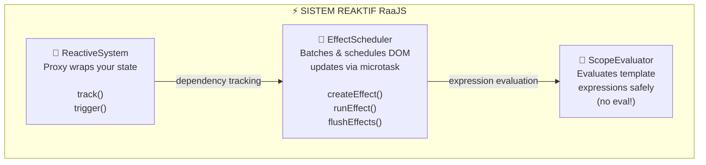
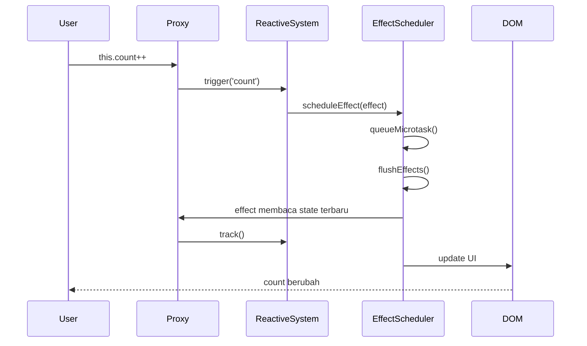

# Model Reaktivitas

> **Versi:** RaaJS v3.1.1 "The Iron Sanctuary"

> Ini adalah halaman terpenting di seluruh dokumentasi. Memahami bagaimana reaktivitas bekerja di RaaJS akan membuat segalanya — debugging, arsitektur, performa — menjadi jauh lebih masuk akal.

> **📌 Catatan v3.1.1:** Model reaktivitas yang dijelaskan di halaman ini tidak berubah secara konsep dari v3.1.0. Namun ada dua perubahan internal yang relevan dan **satu perubahan perilaku** yang perlu kamu tahu: (1) *effect scheduler* kini memakai 4 antrean prioritas terpisah dengan flush O(N); (2) referensi raw object kini memakai Symbol internal; dan (3) **akses `__raa_raw__` melalui string sudah diblokir** — lihat bagian 6 untuk detail dan penggantinya.

---

## Reaktivitas: Kontrak Antara Data dan Tampilan

Sebelum membahas teknis, mari sepakati dulu apa yang kita maksud dengan "reaktivitas".

Reaktivitas adalah sebuah **kontrak**: ketika data berubah, tampilan yang bergantung pada data tersebut akan **secara otomatis** diperbarui. Kamu tidak perlu memberi tahu tampilan untuk berubah — ia tahu sendiri.

Bandingkan dua pendekatan ini:

```javascript
// ─── Cara Lama: kamu harus ingat untuk update DOM ───────────────
let count = 0;
document.getElementById('btn').addEventListener('click', () => {
  count++;
  document.getElementById('angka').textContent = count; // ← harus manual!
});

// ─── Cara RaaJS: cukup ubah data, tampilan mengurus dirinya sendiri ─
state: { count: 0 }

<span raa-bind:text="count"></span>
<button raa-on:click="count++">Tambah</button>
// → Tidak perlu kode update DOM sama sekali.
```

Pada skala kecil, pendekatan manual masih manageable. Tapi bayangkan aplikasi dengan puluhan variabel yang saling bergantung — tanpa reaktivitas, kamu akan menghabiskan lebih banyak waktu untuk melacak "siapa yang perlu diupdate" daripada menulis logika bisnis yang sesungguhnya.

---

## Anatomi Sistem Reaktif RaaJS

RaaJS membangun reaktivitas di atas tiga komponen inti yang bekerja bersama:



Kita akan membahas masing-masing secara mendalam.

---

## 1. ReactiveSystem: Proxy Sebagai "Mata Pengintai"

Jantung dari reaktivitas RaaJS adalah **JavaScript Proxy**.

### Apa itu Proxy?

Bayangkan kamu mempunyai sebuah kotak (objek state). Biasanya, siapa pun bisa mengambil atau menaruh barang di kotak itu tanpa ada yang tahu. Proxy adalah seperti menempatkan seorang **penjaga** di depan kotak itu — setiap kali ada yang mengambil atau menaruh barang, penjaga itu mencatat siapa yang mengakses dan memberi tahu siapa pun yang perlu tahu.

```javascript
// Tanpa Proxy — tidak ada yang tahu ketika 'nama' dibaca atau diubah
const state = { nama: 'Budi', usia: 25 };
state.nama = 'Citra'; // Senyap, tidak ada yang tahu

// Dengan Proxy — setiap akses terpantau
const proxyState = new Proxy(state, {
  get(obj, key) {
    console.log(`'${key}' sedang dibaca`);
    return obj[key];
  },
  set(obj, key, value) {
    console.log(`'${key}' diubah dari '${obj[key]}' menjadi '${value}'`);
    obj[key] = value;
    return true;
  }
});

proxyState.nama;          // Log: 'nama' sedang dibaca
proxyState.nama = 'Dian'; // Log: 'nama' diubah dari 'Citra' menjadi 'Dian'
```

RaaJS membungkus seluruh objek `state`-mu dengan Proxy yang jauh lebih canggih dari contoh di atas. Proxy ini melakukan dua hal krusial:

- **`track()`** — saat sebuah properti *dibaca* di dalam effect, Proxy mencatat ketergantungan tersebut.
- **`trigger()`** — saat sebuah properti *diubah*, Proxy memberi tahu semua effect yang bergantung padanya untuk berjalan ulang.

> **🔒 Diperkuat di v3.1.1:** Proxy kini menyimpan referensi balik ke objek asli (raw) menggunakan **Symbol internal** (`RAA_RAW`) — bukan lagi string `__raa_raw__`. Karena ekspresi template hanya bisa menghasilkan kunci string, jalur ini benar-benar tak tersentuh dari template, menutup celah kebocoran objek raw. Selain itu, saat kamu menugaskan sebuah nilai reaktif ke properti lain (mis. `this.salinan = this.user`), Proxy otomatis *meng-unwrap* nilainya ke objek raw terlebih dahulu — mencegah Proxy berlapis-lapis (proxy di dalam proxy).

### Siklus Reaktif Lengkap

Inilah bagaimana sebuah perubahan state berjalan dari awal hingga tampilan diperbarui:



Satu hal penting: pembaruan DOM tidak terjadi secara **langsung** saat kamu mengubah state. RaaJS menggunakan `queueMicrotask()` untuk **mengelompokkan** semua perubahan yang terjadi dalam satu "giliran" JavaScript, lalu menerapkannya sekaligus ke DOM. Ini jauh lebih efisien daripada memperbarui DOM untuk setiap perubahan satu per satu.

```javascript
// Contoh batching:
methods: {
  updateBanyak() {
    this.nama = 'Budi';    // Belum update DOM
    this.usia = 30;        // Belum update DOM
    this.kota = 'Jakarta'; // Belum update DOM
    // ← Setelah semua ini selesai, baru DOM diperbarui SEKALI
  }
}
```

---

## 2. EffectScheduler: Otak yang Mengatur Waktu

Effect adalah **fungsi kecil** yang mengetahui cara memperbarui satu bagian spesifik dari DOM. Setiap direktif binding (`raa-bind:text`, `raa-bind:class`, dll.) menciptakan satu effect.

```
raa-bind:text="nama"                → effect: () => el.textContent = state.nama
raa-bind:class="{ aktif: isAktif }" → effect: () => applyClassBinding(el, ...)
raa-flow:if="tampil"                → effect: () => renderOrRemoveTemplate(...)
```

EffectScheduler mengelola semua effect ini dengan sistem **prioritas**:

| Level | Nilai | Digunakan untuk |
|---|---|---|
| `HIGH` | 0 | Effect kritis yang harus berjalan duluan |
| `NORMAL` | 1 | Binding biasa (default untuk semua direktif) |
| `LOW` | 2 | Effect yang bisa ditunda sedikit |
| `IDLE` | 3 | Pekerjaan latar belakang yang tidak urgent |

Dalam praktiknya, kamu tidak perlu memikirkan prioritas ini kecuali saat menulis plugin kustom. RaaJS mengurus semua ini secara otomatis.

> **⚡ Dioptimalkan di v3.1.1:** Sebelumnya keempat level prioritas ini hidup dalam satu antrean tunggal yang harus **diurutkan** (`sort`) di setiap flush — biaya O(N log N). Mulai v3.1.1, scheduler memakai **empat bucket `Set` terpisah** (satu per level prioritas) yang dikuras berurutan dari HIGH ke IDLE — flush kini murni O(N), tanpa alokasi array untuk sorting, dengan deduplikasi alami bawaan `Set`. Effect yang dijadwalkan *di tengah* flush juga dijamin tidak ikut berjalan di siklus yang sama — ia menunggu microtask berikutnya (snapshot per bucket).

### Deteksi Loop Tak Terbatas

EffectScheduler juga memiliki sistem proteksi: jika sebuah effect berjalan lebih dari **50 kali** dalam satu flush cycle, RaaJS akan menghentikannya dan menampilkan peringatan di konsol:

```
[RaaJS warn:EFFECT_LOOP] Effect loop detected — skipping effect to prevent infinite cycle.
```

Ini biasanya terjadi ketika sebuah effect secara tidak sengaja memodifikasi state yang menjadi dependensinya sendiri, menciptakan lingkaran tak terbatas.

> **🛡️ Catatan v3.1.1:** Pada mode production (non-debug), pesan peringatan ini tidak lagi menyertakan referensi langsung ke DOM node — hanya string deskriptor seperti `<button#tambah.btn>`. Ini mencegah konsol browser menahan node yang seharusnya sudah bisa dibersihkan garbage collector (kebocoran memori halus yang ada di versi sebelumnya). Saat `debug: true`, referensi node tetap ditampilkan utuh agar bisa di-inspect.

---

## 3. Apa yang Reaktif dan Apa yang Tidak

Ini adalah bagian yang paling penting untuk dipahami agar kamu tidak mengalami bug yang membingungkan.

### ✅ Yang Reaktif

**Semua properti yang dideklarasikan di dalam `state` dari awal:**

```javascript
RaaJS.define('contoh', () => ({
  state: {
    teks: 'Halo',           // ✅ reaktif
    angka: 42,              // ✅ reaktif
    aktif: true,            // ✅ reaktif
    daftar: [1, 2, 3],      // ✅ reaktif (array)
    user: {                 // ✅ reaktif
      nama: 'Budi',         // ✅ termasuk properti nested
      alamat: {
        kota: 'Jakarta'     // ✅ nested dalam-pun reaktif
      }
    }
  }
}));
```

**Mutasi array menggunakan method bawaan:**

```javascript
// Semua method berikut MEMICU reaktivitas:
this.daftar.push(4);           // ✅
this.daftar.pop();             // ✅
this.daftar.shift();           // ✅
this.daftar.unshift(0);        // ✅
this.daftar.splice(1, 1);      // ✅
this.daftar.sort();            // ✅
this.daftar.reverse();         // ✅
this.daftar.fill(0);           // ✅
this.daftar.copyWithin(0, 1);  // ✅

// Mengganti seluruh array juga reaktif:
this.daftar = [10, 20, 30];    // ✅
```

**Menghapus properti dengan `delete`:**

```javascript
// Proxy v3.1.1 memiliki trap deleteProperty — penghapusan juga terpantau:
delete this.user.alamat;       // ✅ memicu update pada effect yang membaca 'alamat'
```

---

### ❌ Yang TIDAK Reaktif (Jebakan Umum!)

#### Jebakan 1: Menambah properti baru setelah kompilasi

Ini adalah jebakan paling umum. Properti yang ditambahkan ke objek state **setelah** RaaJS mengkompilasinya tidak akan terpantau oleh Proxy.

```javascript
methods: {
  init() {
    // ❌ Properti baru yang ditambahkan belakangan — TIDAK reaktif!
    this.propertiTambahan = 'Nilai';

    // ✅ Cara benar: deklarasikan dari awal di state
    // state: { propertiTambahan: '' }
    // Lalu di sini: this.propertiTambahan = 'Nilai';
  }
}
```

**Solusi:** Selalu deklarasikan semua properti state yang kamu butuhkan di dalam objek `state` sejak awal, meskipun nilainya kosong atau `null`.

```javascript
state: {
  data: null,          // Akan diisi nanti — tapi sudah reaktif
  isLoaded: false,
  errorMsg: ''
}
```

> **💡 Bantuan debug:** Jika di template kamu menulis (lewat `raa-bind:model` atau `raa-on:`) ke properti yang **tidak ada** di state, mode debug v3.1.1 akan menampilkan peringatan `[RaaJS warn:UNKNOWN_KEY] Assigning to unknown key "..." on state. If this is a typo, fix the template expression.` — sangat membantu menangkap typo nama properti lebih awal.

#### Jebakan 2: Memodifikasi elemen array by index

```javascript
// ❌ TIDAK memicu reaktivitas — RaaJS tidak mendeteksi perubahan ini
this.daftar[0] = 'NilaiBaru';

// ✅ Gunakan splice sebagai gantinya
this.daftar.splice(0, 1, 'NilaiBaru');

// ✅ Atau ganti seluruh array
this.daftar = this.daftar.map((item, i) => i === 0 ? 'NilaiBaru' : item);
```

#### Jebakan 3: Memodifikasi `.length` array secara langsung

```javascript
// ❌ TIDAK memicu reaktivitas
this.daftar.length = 0;

// ✅ Gunakan splice untuk mengosongkan array
this.daftar.splice(0);

// ✅ Atau ganti dengan array kosong
this.daftar = [];
```

#### Jebakan 4: Mutasi objek yang dikembalikan dari computed (bukan state langsung)

```javascript
// ❌ Ini memodifikasi salinan, bukan state asli
const user = this.user; // user adalah proxy
user.nama = 'Baru';     // Ini MEMANG reaktif karena user masih proxy

// Yang tidak reaktif: ketika kamu menggunakan spread operator
// yang melepas reaktivitas:
const rawUser = { ...this.user }; // ← ini adalah plain object, BUKAN proxy
rawUser.nama = 'Baru'; // ❌ tidak memicu apa pun
```

> **⚠️ Diperketat di v3.1.1:** Pada versi sebelumnya, objek raw juga bisa "bocor" lewat properti string `__raa_raw__` — dan mutasi terhadapnya senyap tanpa reaktivitas. Mulai v3.1.1, kunci string `__raa_raw__` masuk daftar blokir (`BLOCKED_KEYS`) dan referensi raw diganti dengan Symbol internal yang tidak bisa diakses dari kode aplikasi maupun ekspresi template. Satu sumber jebakan senyap resmi ditutup.

---

## 4. Reaktivitas pada Objek Nested

RaaJS mendukung reaktivitas pada objek bersarang secara otomatis — tidak ada yang perlu kamu lakukan secara khusus.

```javascript
state: {
  user: {
    profil: {
      nama: 'Budi',
      kontak: {
        email: 'budi@contoh.com'
      }
    }
  }
}

// Template:
// <p raa-bind:text="user.profil.nama"></p>
// <p raa-bind:text="user.profil.kontak.email"></p>

// Perubahan di mana pun dalam nested object TETAP reaktif:
methods: {
  updateEmail() {
    this.user.profil.kontak.email = 'baru@contoh.com'; // ✅ reaktif!
  }
}
```

Ini bekerja karena saat Proxy mendeteksi akses ke properti yang nilainya objek, ia akan secara rekursif membungkus objek tersebut dengan Proxy baru. Hasilnya, seluruh pohon objek terlindungi secara reaktif.

> **⚡ Efisien:** Pembungkusan rekursif ini di-*cache* via WeakMap (`_reactiveCache`) — objek nested yang sama selalu menghasilkan Proxy yang sama, tidak dibuat ulang di setiap akses. Di v3.1.1, prinsip cache yang sama juga diterapkan pada *scope proxy* milik evaluator ekspresi (cache per pasangan elemen × state), sehingga evaluasi ekspresi template di jalur panas tidak lagi mengalokasikan Proxy baru setiap kali.

---

## 5. Perbandingan Nilai yang Cerdas (NaN-Safe)

RaaJS menggunakan `Object.is()` — bukan `===` biasa — untuk membandingkan nilai lama dan baru sebelum memutuskan apakah perlu memicu update.

Kenapa ini penting? Karena JavaScript memiliki satu keanehan yang terkenal:

```javascript
NaN === NaN // → false (!)
```

Ini berarti jika kamu menggunakan `===`, setiap kali state berisi `NaN`, sistem akan selalu menganggap nilainya berubah (padahal tidak), menyebabkan update DOM yang tidak perlu setiap saat.

`Object.is()` menangani ini dengan benar:

```javascript
Object.is(NaN, NaN) // → true ✅
Object.is(0, -0)    // → false (perbedaan yang valid)
Object.is(1, 1)     // → true
Object.is('a', 'a') // → true
```

Dalam praktik, ini berarti: jika kamu mengubah state dengan nilai yang **sama persis** dengan nilai sebelumnya, RaaJS **tidak akan** memicu update DOM yang tidak perlu. Efisien secara otomatis.

```javascript
methods: {
  coba() {
    this.count = 5;
    this.count = 5; // ← Nilai sama, tidak ada DOM update yang dipicu!
    this.count = 5; // ← Sama lagi, tetap tidak ada update.
  }
}
```

---

## 6. Memeriksa Reaktivitas Secara Manual *(Diubah di v3.1.1!)*

Selama development, kamu bisa memeriksa apakah sebuah objek adalah Proxy reaktif atau plain object biasa melalui konsol browser:

```javascript
// Akses raw object (non-proxy) dari state
const rawState = window.Raa.roots  // tidak langsung tersedia

// Cara praktis via DevTools:
// 1. Buka panel DevTools (Ctrl+Shift+R)
// 2. Pilih root yang ingin kamu periksa
// 3. Klik "Export State" atau edit langsung via God Mode
```

### ⚠️ `__raa_raw__` Sudah Dihapus di v3.1.1

Di versi sebelumnya, kamu bisa mengakses raw object melalui properti string `__raa_raw__`. **Mulai v3.1.1, cara ini tidak lagi berfungsi:**

```javascript
methods: {
  debug() {
    // ❌ v3.1.1: TIDAK BERFUNGSI LAGI
    const raw = this.__raa_raw__;
    // → undefined dari kode method;
    // → di ekspresi template malah melempar error "blocked property"
  }
}
```

Alasannya: referensi raw kini disimpan di balik **Symbol internal** (`RAA_RAW`), dan string `__raa_raw__` (beserta semua kunci berawalan `__raa_`) masuk daftar blokir keamanan. Ini bagian dari penutupan vektor *prototype pollution* — tidak ada lagi pintu belakang ber-string menuju isi mesin.

### ✅ Pengganti yang Aman di v3.1.1

Untuk kebutuhan yang sama (serialisasi & logging), gunakan pola berikut:

```javascript
methods: {
  debug() {
    // ✅ Serialisasi: JSON.stringify bekerja langsung pada proxy
    console.log(JSON.stringify(this));

    // ✅ Salinan plain-object (snapshot, terlepas dari reaktivitas)
    const snapshot = JSON.parse(JSON.stringify(this));

    // ✅ Salinan dangkal satu objek nested
    const userCopy = { ...this.user };
  }
}
```

> **Catatan:** Sama seperti dulu, mengubah nilai pada salinan/snapshot ini **tidak** memicu reaktivitas — gunakan hanya untuk membaca, serialisasi, atau logging.

### Variabel Spesial di Ekspresi Template

Untuk inspeksi dari dalam template, evaluator v3.1.1 menyediakan variabel spesial berikut (hanya berlaku di ekspresi direktif, bukan di dalam method):

| Variabel | Isi |
|---|---|
| `$state` | Proxy state milik root saat ini |
| `$store` | Global store bersama antar aplikasi |
| `$refs` | Elemen-elemen yang didaftarkan via `raa-core:ref` |
| `$el` | Elemen tempat ekspresi sedang dievaluasi |
| `$locals` | Variabel lokal warisan dari `raa-flow:for` di atasnya |

---

## 7. Reaktivitas dan DOM: Apa yang Bisa dan Tidak Bisa

Tidak semua nilai cocok untuk disimpan di state. RaaJS secara cerdas mengenali nilai-nilai yang **tidak perlu** dibungkus Proxy:

| Tipe Nilai | Reaktif? | Alasan |
|---|---|---|
| `string`, `number`, `boolean`, `null` | Langsung | Primitif tidak perlu Proxy |
| Plain object `{}` | ✅ Ya | Dibungkus Proxy rekursif |
| Array `[]` | ✅ Ya | Dibungkus Proxy + method mutation |
| `Date` object | ❌ Tidak | Dibiarkan as-is (mutasi internal tidak terpantau) |
| `RegExp` | ❌ Tidak | Tidak perlu reaktif |
| `Promise` | ❌ Tidak | Async handling tidak butuh Proxy |
| Elemen DOM | ❌ Tidak | RaaJS mendeteksi dan melewati node DOM |

> **Catatan presisi:** "Plain object" di sini benar-benar berarti objek polos — engine memeriksa `Object.getPrototypeOf(value) === Object.prototype`. Instance dari class kustom (misalnya `new Pengguna()`) **tidak** akan dibungkus Proxy dan karenanya tidak reaktif. Simpan data sebagai objek/array literal biasa.

**Implikasi untuk `Date`:**

```javascript
state: {
  tanggal: new Date() // ← Disimpan as-is, bukan Proxy
}

methods: {
  updateTanggal() {
    // ❌ Ini tidak reaktif — Proxy tidak memantau mutasi internal Date
    this.tanggal.setFullYear(2025);

    // ✅ Ganti dengan instance baru agar reaktif
    this.tanggal = new Date(2025, 0, 1);
  }
}
```

---

## 8. Contoh: Melihat Reaktivitas Bekerja Nyata

Mari buat sebuah contoh yang mendemonstrasikan berbagai aspek reaktivitas yang sudah kita bahas:

```html
<!DOCTYPE html>
<html lang="id">
<head>
  <meta charset="UTF-8">
  <title>Demo Reaktivitas</title>
  <style>
    body { font-family: sans-serif; padding: 24px; max-width: 560px; }
    .box { border: 1px solid #e2e8f0; border-radius: 8px; padding: 16px; margin-bottom: 16px; }
    .label { font-size: 11px; color: #94a3b8; font-weight: 600; text-transform: uppercase; margin-bottom: 4px; }
    .nilai { font-size: 28px; font-weight: 800; color: #3b82f6; }
    button { background: #3b82f6; color: white; border: none; padding: 8px 16px; border-radius: 6px; cursor: pointer; margin: 4px; }
    button.merah { background: #ef4444; }
    input[type=range] { width: 100%; }
    li { padding: 4px 0; border-bottom: 1px solid #f1f5f9; }
  </style>
</head>
<body>

  <h2>🔬 Lab Reaktivitas RaaJS</h2>

  <div raa-core:app="labReaktif">

    <!-- Demo 1: Primitive State -->
    <div class="box">
      <p class="label">Demo 1 — State Primitif</p>
      <p class="nilai" raa-bind:text="counter"></p>
      <button raa-on:click="counter++">+ Tambah</button>
      <button class="merah" raa-on:click="counter--">- Kurang</button>
      <button raa-on:click="counter = 0">Reset</button>
    </div>

    <!-- Demo 2: Object Nested -->
    <div class="box">
      <p class="label">Demo 2 — Object Nested</p>
      <input type="text" raa-bind:model="user.nama"
             placeholder="Ketik nama..."
             style="border:1px solid #e2e8f0; padding:8px; border-radius:6px; width:100%; box-sizing:border-box;">
      <p style="margin-top:8px;">
        Halo, <strong raa-bind:text="user.nama || 'Siapa kamu?'"></strong>!
        Dari kota <em raa-bind:text="user.kota"></em>.
      </p>
    </div>

    <!-- Demo 3: Array Reactivity -->
    <div class="box">
      <p class="label">Demo 3 — Array Reaktif</p>
      <button raa-on:click="tambahItem()">Tambah Item Acak</button>
      <button class="merah" raa-on:click="hapusItem()">Hapus Item Pertama</button>
      <button raa-on:click="acakUrutan()">Acak Urutan</button>
      <p style="margin-top:8px; font-size:12px; color:#64748b;">
        Total: <span raa-bind:text="items.length"></span> item
      </p>
      <ul style="margin:0; padding-left:20px;">
        <template raa-flow:for="item in items" raa-key="item.id">
          <li raa-bind:text="item.label"></li>
        </template>
      </ul>
    </div>

    <!-- Demo 4: Batching -->
    <div class="box">
      <p class="label">Demo 4 — Batching Update</p>
      <p style="font-size:12px; color:#64748b; margin-bottom:8px;">
        Klik tombol di bawah — tiga properti berubah sekaligus,
        tapi DOM hanya diperbarui SEKALI (perhatikan tidak ada flash/flicker):
      </p>
      <button raa-on:click="updateSemua()">Update 3 State Sekaligus</button>
      <div style="margin-top:12px; display:flex; gap:16px;">
        <div>
          <p class="label">A</p>
          <p class="nilai" raa-bind:text="stateA"></p>
        </div>
        <div>
          <p class="label">B</p>
          <p class="nilai" raa-bind:text="stateB"></p>
        </div>
        <div>
          <p class="label">C</p>
          <p class="nilai" raa-bind:text="stateC"></p>
        </div>
      </div>
    </div>

  </div>

  <script src="https://cdn.jsdelivr.net/gh/dazep01/raajs@3.1.1/engine/raa.min.js"></script>
  <script>
    let idCounter = 10;

    RaaJS.define('labReaktif', () => ({
      state: {
        // Demo 1
        counter: 0,

        // Demo 2
        user: { nama: '', kota: 'Bandung' },

        // Demo 3
        items: [
          { id: 1, label: 'Item Pertama' },
          { id: 2, label: 'Item Kedua' },
          { id: 3, label: 'Item Ketiga' }
        ],

        // Demo 4
        stateA: 0,
        stateB: 0,
        stateC: 0
      },
      methods: {
        tambahItem() {
          idCounter++;
          this.items.push({ // ✅ push() memicu reaktivitas
            id: idCounter,
            label: 'Item #' + idCounter
          });
        },
        hapusItem() {
          if (this.items.length > 0) {
            this.items.shift(); // ✅ shift() memicu reaktivitas
          }
        },
        acakUrutan() {
          this.items.sort(() => Math.random() - 0.5); // ✅ sort() memicu reaktivitas
        },
        updateSemua() {
          // Tiga perubahan — hanya satu flush ke DOM
          this.stateA = Math.floor(Math.random() * 100);
          this.stateB = Math.floor(Math.random() * 100);
          this.stateC = Math.floor(Math.random() * 100);
        }
      }
    }));
  </script>

</body>
</html>
```

---

## Ringkasan: Tiga Hukum Reaktivitas RaaJS

Seluruh halaman ini bisa diringkas menjadi tiga hukum yang wajib kamu ingat:

### Hukum 1 — Deklarasikan dari Awal

> Hanya properti yang ada di dalam objek `state` sejak aplikasi diinisialisasi yang akan reaktif. Properti yang ditambahkan belakangan tidak akan terpantau.

### Hukum 2 — Gunakan Method untuk Array

> Untuk memodifikasi array secara reaktif, gunakan method bawaan: `push`, `pop`, `shift`, `unshift`, `splice`, `sort`, `reverse`, `fill`, `copyWithin` — atau ganti seluruh array dengan assignment. Jangan modifikasi elemen langsung via index.

### Hukum 3 — Percayakan Pembaruan DOM ke RaaJS

> Jangan pernah memperbarui DOM secara manual untuk data yang sudah dikelola RaaJS. Cukup ubah state, dan RaaJS akan mengurus sisanya — lebih efisien, lebih aman, dan lebih dapat diandalkan.

---

*Dokumentasi ini adalah bagian dari RaaJS v3.1.1 Official Docs. Kontribusi dan koreksi disambut di repositori resmi.*