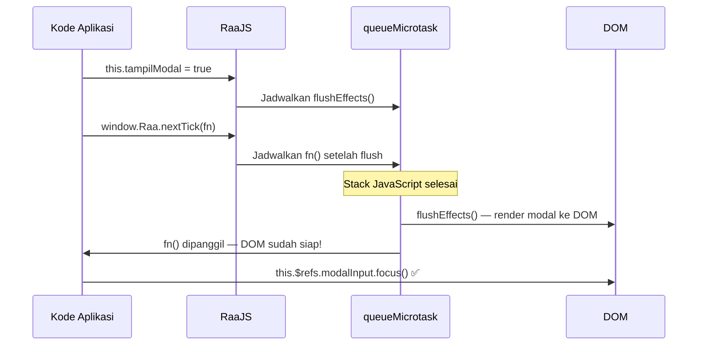

# Siklus Hidup Aplikasi 

> **Versi:** RaaJS v3.1.0 "Data Liberation"
> *Panduan Naratif: Memahami Perjalanan Aplikasi dari Lahir hingga "Pensiun"*

Memahami siklus hidup aplikasi ibarat mengenal karakter dalam sebuah novel: kita tahu kapan dia lahir, bagaimana dia bertumbuh, momen-momen kritis yang dialaminya, dan bagaimana dia "pensiun" dengan elegan. Di RaaJS, siklus hidup bukan sekadar konsep teknis—ini adalah **peta navigasi** untuk menulis kode yang bersih, efisien, dan bebas dari *memory leak*.

Mari kita telusuri perjalanan lengkap sebuah aplikasi RaaJS, dari detik pertama ia "diciptakan" hingga saat ia "melepaskan diri" dari DOM, dengan gaya yang lebih naratif namun tetap padat teknis.

---

## Mengapa Siklus Hidup Itu Penting? (Dan Kenapa Kamu Harus Peduli)

Bayangkan kamu sedang membangun rumah. Kamu tidak akan memasang genteng sebelum pondasinya selesai, bukan? Begitu pula dengan aplikasi web. Setiap aplikasi memiliki "fase kehidupan" yang harus dihormati agar semuanya berjalan harmonis.

Developer yang hebat bukan hanya yang bisa membuat fitur berjalan, tapi yang tahu **kapan tepatnya** melakukan sesuatu:

| Pertanyaan Nyata | Jawaban dari Siklus Hidup |
|-----------------|---------------------------|
| *"Kapan saya fetch data dari API?"* | Setelah state siap, tapi sebelum user berinteraksi — biasanya di `init()` atau `afterCompile` |
| *"Di mana saya buka koneksi WebSocket?"* | Saat aplikasi sudah "hidup", dan pastikan ditutup saat `beforeDestroy` |
| *"Bagaimana cara bersih-bersih event listener?"* | Serahkan ke `deepCleanup` atau tangani manual di `beforeDestroy` |
| *"Kapan saya bisa akses DOM setelah state berubah?"* | Gunakan `nextTick()` — karena DOM update itu asinkron! |

Dengan memahami siklus hidup, kamu bukan lagi "menebak-nebak", tapi **mengendalikan alur** aplikasi dengan presisi.

---

## Gambaran Besar: Perjalanan Sebuah Aplikasi RaaJS

Sebelum masuk ke detail, mari kita lihat peta perjalanannya secara naratif:

### Fase 0: Kelahiran (Bootstrap)
Saat browser selesai memuat HTML dan memicu `DOMContentLoaded`, RaaJS "bangun dari tidur". Dua hal penting terjadi hampir bersamaan:
1. **Instance global dibuat**: `window.Raa` lahir sebagai "otak pusat" yang mengatur seluruh reaktivitas di halaman.
2. **MutationObserver dipasang**: Ini adalah "mata-mata" yang mengawasi perubahan DOM secara real-time, memungkinkan RaaJS merespons elemen dinamis yang ditambahkan setelah halaman pertama kali dimuat.

> 💡 *Fun fact: MutationObserver inilah yang membuat RaaJS bisa bekerja mulus dengan SPA, AJAX content, atau framework lain yang memanipulasi DOM secara dinamis.*

### Fase 1: Kompilasi (The Compilation Phase)
Begitu RaaJS menemukan elemen dengan atribut `raa-core:app`, proses "kompilasi" dimulai. Ini adalah fase terpanjang dan paling kritis, di mana aplikasi benar-benar "dibangun".

Prosesnya berjalan seperti ini:

1. **Hook `beforeCompile` dipicu** — Plugin mendapat kesempatan untuk memodifikasi elemen root sebelum diproses lebih lanjut.
2. **State dibungkus Proxy** — Data mentah diubah menjadi objek reaktif yang bisa "melacak" perubahan.
3. **Persisted state dimuat** — Jika ada data yang disimpan di `localStorage`, ia dipulihkan ke state.
4. **Methods diikat ke state** — Fungsi-fungsi di `methods` sekarang bisa mengakses `this.state` secara reaktif.
5. **compileSubtree dijalankan** — RaaJS memindai seluruh subtree elemen untuk menemukan direktif seperti `raa-bind:`, `raa-on:`, `raa-flow:`, dll.

#### Dua Pass Kompilasi: Kenapa Harus Dua Kali?

Kompilasi subtree dilakukan dalam **dua putaran terpisah** dengan alasan yang sangat teknis:

**Pass 1 — Sinkronus & Tidak Reaktif**  
Di sini, RaaJS melakukan hal-hal yang harus selesai *sebelum* reaktivitas berjalan:
- Mendaftarkan `$refs` (akses cepat ke elemen DOM via `raa-core:ref`)
- Memasang event listener (`raa-on:click`, `raa-on:input`, dll)
- Menjalankan inisialisasi elemen (`raa-core:init`)

**Pass 2 — Reaktif & Berbasis Effect**  
Baru setelah Pass 1 selesai, RaaJS membuat "Effect" untuk setiap binding reaktif:
- `raa-bind:text` → Effect yang update teks saat state berubah
- `raa-bind:model` → Two-way binding yang sinkron antara input dan state
- `raa-flow:if`, `raa-flow:for`, `raa-flow:show` → Effect yang mengontrol render kondisional

> 🎯 *Kenapa tidak digabung? Bayangkan jika binding reaktif dijalankan sebelum event listener terpasang: user bisa mengetik di input, tapi handler-nya belum siap. Chaos!*

6. **Network & Router Setup** — Jika aplikasi menggunakan fetch, WebSocket, atau routing, semuanya diinisialisasi di sini.
7. **Hook `afterCompile` dipicu** — Plugin bisa menyuntikkan API tambahan ke state (misal: `$http`, `$bus`, `$t` untuk i18n).
8. **`init()` dipanggil via `queueMicrotask`** — Fungsi `init` di definisi aplikasi dijalankan *setelah* semua efek terdaftar, memastikan state benar-benar siap.

### Fase 2: Aplikasi Berjalan (The Reactive Phase)
Setelah kompilasi selesai, aplikasi memasuki fase "hidup". Di sinilah keajaiban reaktivitas terjadi secara kontinu.

#### Siklus Effect: Bagaimana Reaktivitas Bekerja?

Setiap kali kamu mengubah state (misal: `this.count++`), berikut yang terjadi di balik layar:

1. **Proxy mendeteksi perubahan** — `Proxy.set` terpanggil, memicu sistem tracking.
2. **Effect yang bergantung pada key tersebut dijadwalkan** — Tidak langsung dijalankan, tapi dimasukkan ke antrian `pendingEffects`.
3. **`queueMicrotask` memicu flush** — Di akhir tick JavaScript, semua effect yang tertunda dijalankan sekaligus (batching untuk performa).
4. **Effect dijalankan sesuai prioritas** — Effect dengan dependensi lebih "dasar" dijalankan duluan.
5. **DOM diperbarui** — Hasil eksekusi effect tercermin di UI.
6. **Dependensi diperbarui** — Effect "melupakan" dependensi lama dan mencatat yang baru untuk siklus berikutnya.

> ⚡ *Ini adalah reason mengapa RaaJS sangat efisien: perubahan state tidak langsung memicu re-render DOM, tapi di-batch dan dioptimalkan via dependency tracking.*

### Fase 3: Penghancuran (The Cleanup Phase)
Ketika elemen root dihapus dari DOM (atau `destroyRoot()` dipanggil manual), RaaJS tidak sekadar "menghilangkan" elemen tersebut. Ia melakukan **pembersihan menyeluruh** untuk mencegah memory leak — masalah klasik di aplikasi SPA yang sering terlupakan.

Proses penghancuran berjalan seperti ini:

1. **Hook `beforeDestroy` dipicu** — Kesempatan terakhir untuk plugin atau developer membersihkan resource (timer, subscription, dll).
2. **Network resources dibatalkan** — Semua `fetch` yang sedang berjalan di-abort via `AbortController`, WebSocket ditutup dengan `close()`.
3. **Router handler dilepas** — Event listener `hashchange` atau `popstate` di-unregister.
4. **Semua Effect di-dispose** — Effect yang terdaftar di root dihentikan agar tidak lagi merespons perubahan state.
5. **`deepCleanup` berjalan rekursif** — Ini adalah "sapu bersih" yang mengunjungi setiap elemen di subtree:
   - Event listener yang dipasang via `raa-on:` dilepas
   - Observer (seperti IntersectionObserver untuk lazy load) di-disconnect
   - Node kondisional (`raa-flow:if`) yang sedang ter-render dibersihkan
   - Block loop (`raa-flow:for`) di-destroy per item
6. **Hook `afterDestroy` dipicu** — Plugin bisa menghapus referensi internal atau mengirim log analitik.
7. **Referensi internal di-null-kan** — `__raa_compiled__ = false`, `__raa_state__ = null` agar GC (Garbage Collector) browser bisa membebaskan memori.

> 🛡️ *Tanpa `deepCleanup`, setiap kali `raa-flow:if` merender ulang atau `raa-flow:for` menghasilkan item baru, effect-effect lama akan menumpuk di memori. RaaJS menangani ini secara otomatis — kamu tinggal fokus ke fitur.*

---

## Siklus Hidup Khusus: Elemen Kondisional & Loop

Tidak semua elemen mengikuti siklus hidup root utama. Elemen yang dikontrol oleh `raa-flow:if` dan `raa-flow:for` memiliki "kehidupan mini" mereka sendiri.

### `raa-flow:if`: Lahir, Mati, dan Lahir Lagi

Elemen di dalam `raa-flow:if` tidak sekadar "disembunyikan" — mereka **dihancurkan dan diciptakan ulang** setiap kali kondisi berubah.

```
Kondisi false → true:
1. Template di-clone menjadi DocumentFragment
2. compileSubtree dijalankan pada fragment tersebut
3. Hasilnya dimasukkan ke DOM
4. raa-core:init di dalam template berjalan ulang

Kondisi true → false:
1. deepCleanup dijalankan pada subtree
2. Elemen dihapus dari DOM
3. Effect-effect di dalamnya di-dispose
```

> 🎯 *Implikasi penting: Jika kamu punya input dengan `raa-core:ref` di dalam `raa-flow:if`, ref tersebut akan "hilang" saat kondisi false, dan "muncul baru" saat kondisi true. Ini desain yang disengaja agar tidak ada state yang "terjebak" di elemen yang seharusnya tidak aktif.*

### `raa-flow:for`: Keyed Diffing yang Cerdas

Loop di RaaJS tidak sekadar "render ulang semua". Ia menggunakan **keyed diffing algorithm** yang mirip dengan framework modern lainnya:

```
Array state berubah:
1. Effect raa-flow:for berjalan ulang
2. RaaJS membandingkan array baru dengan blok yang sudah ada di DOM
3. Untuk setiap item:
   - Jika key-nya sudah ada → ♻️ Reuse blok lama, update locals, jalankan ulang effects subtree
   - Jika key-nya baru → 🆕 Clone template, compileSubtree, sisipkan ke DOM
   - Jika key-nya hilang → 💀 destroyForBlock, hapus dari DOM
4. Posisi DOM diatur ulang jika urutan berubah (via moveRenderedNodesAfterAnchor)
```

> 🔑 *Inilah mengapa `raa-key` yang stabil dan unik sangat krusial. Tanpa key yang konsisten, RaaJS tidak bisa mengenali item mana yang berubah, dan terpaksa merender ulang semuanya — performa turun drastis.*

---

## Hook Siklus Hidup untuk Plugin: Titik Ekstensi yang Powerful

Plugin RaaJS tidak "menempel" sembarangan. Mereka menggunakan **hook lifecycle** yang terdefinisi dengan jelas untuk menyisipkan logika di momen-momen kritis.

### Timeline Hook dalam Satu Siklus Kompilasi

**Sebelum Kompilasi (`beforeCompile`)**  
- Plugin bisa memodifikasi elemen root sebelum diproses
- Contoh: DevTools mendaftarkan root baru ke panel monitoring

**Selama Kompilasi (`compileSubtree`)**  
- Direktif kustom plugin diproses bersamaan dengan direktif bawaan
- Contoh: `raa-http`, `raa-validate`, `raa-animation` menjalankan logika spesifiknya

**Setelah Kompilasi (`afterCompile`)**  
- Plugin menyuntikkan API ke state reaktif
- Contoh: 
  - `raa-http` → `$http.get()`, `$http.post()`
  - `raa-eventbus` → `$bus.on()`, `$bus.emit()`
  - `raa-i18n` → `$t()`, `$locale`
  - `raa-computed-watch` → setup computed properties & watchers

**Sebelum Penghancuran (`beforeDestroy`)**  
- Plugin membersihkan resource yang mereka alokasikan
- Contoh:
  - `raa-animation` → melepas IntersectionObserver
  - `raa-http` → membatalkan request & poller yang masih berjalan
  - `raa-eventbus` → melepas subscription event
  - `raa-validate` → melepas event listener validasi

**Setelah Penghancuran (`afterDestroy`)**  
- Cleanup final dan penghapusan dari registry internal
- Contoh: DevTools menghapus root dari panel monitoring

### Cara Mendaftarkan Hook dari Plugin

```javascript
const PluginKu = {
  name: 'plugin-ku',
  install(raa) {

    // Hook sebelum kompilasi — untuk modifikasi awal
    raa.pluginManager.addHook('beforeCompile', (root) => {
      console.log('🔍 Akan mengkompilasi:', root.getAttribute('raa-core:app'));
      // Bisa modifikasi atribut, tambahkan class, dll
    }, 'plugin-ku');

    // Hook setelah kompilasi — untuk injeksi API
    raa.pluginManager.addHook('afterCompile', (root, state) => {
      state.$mySuperPower = () => {
        console.log('✨ Super power activated!');
      };
    }, 'plugin-ku');

    // Hook sebelum penghancuran — untuk cleanup
    raa.pluginManager.addHook('beforeDestroy', (root) => {
      // Bersihkan timer, subscription, atau resource lain
      if (root.__myTimer) clearInterval(root.__myTimer);
    }, 'plugin-ku');

    // Hook setelah penghancuran — untuk final cleanup
    raa.pluginManager.addHook('afterDestroy', (root) => {
      // Hapus referensi dari registry internal plugin
      myInternalRegistry.delete(root);
    }, 'plugin-ku');
  }
};
```

> 💡 *Tips: Selalu berikan nama plugin sebagai parameter ketiga di `addHook` agar hook bisa diidentifikasi dan di-debug dengan mudah.*

---

## `nextTick()`: Menunggu DOM Selesai Diperbarui (Tanpa Pusing)

Ada momen klasik yang sering membuat developer bingung: *"Saya ubah state, tapi DOM belum berubah saat saya coba akses elemen-nya. Kenapa?!"*

Jawabannya: **Perubahan DOM di RaaJS tidak sinkronus**. Ia di-batch via `queueMicrotask` untuk optimasi performa.

### Solusi: `window.Raa.nextTick()`

Fungsi ini memungkinkan kamu menjadwalkan kode yang akan dijalankan *setelah* semua effect selesai dan DOM benar-benar diperbarui.



### Contoh Penggunaan Nyata

```javascript
methods: {
  // ✅ Contoh 1: Fokus ke elemen yang baru muncul
  async bukaModal() {
    this.tampilModal = true;

    // ❌ Tanpa nextTick: modal belum ada di DOM!
    // this.$refs.inputModal.focus(); // Error: cannot focus null

    // ✅ Dengan nextTick: tunggu DOM siap
    await window.Raa.nextTick();
    this.$refs.inputModal.focus(); // Berhasil!
  },

  // ✅ Contoh 2: Scroll ke bawah setelah tambah pesan chat
  async kirimPesan() {
    this.pesan.push({ 
      teks: this.inputPesan, 
      waktu: Date.now() 
    });
    this.inputPesan = '';

    await window.Raa.nextTick();

    // Elemen pesan terbaru sudah dirender
    const container = this.$refs.containerPesan;
    container.scrollTop = container.scrollHeight; // Scroll mulus!
  },

  // ✅ Contoh 3: Callback style (tanpa async/await)
  tambahItem() {
    this.daftar.push({ 
      id: Date.now(), 
      nama: 'Item Baru' 
    });

    window.Raa.nextTick(() => {
      // Jalankan setelah DOM selesai diperbarui
      const items = document.querySelectorAll('.item-baru');
      items[items.length - 1].classList.add('highlight');
    });
  }
}
```

> 🎯 *Pattern ini sangat berguna untuk animasi masuk, fokus otomatis, atau pengukuran dimensi elemen yang baru dirender.*

---

## Siklus Hidup Effect: Di Balik Layar Reaktivitas

Setiap binding reaktif di RaaJS (`raa-bind:`, `raa-flow:`, dll) adalah sebuah **Effect** — fungsi kecil yang "hidup" dan berjalan ulang setiap kali dependensinya berubah.

### Journey Sebuah Effect

```
1. Dibuat → createEffect() dipanggil saat kompilasi
2. Berjalan Pertama Kali → runEffect() eksekusi pertama, dependensi dicatat
3. Aktif → Effect "tidur" sambil menunggu dependensi berubah
4. Dijadwalkan → State yang jadi dependensi berubah, effect masuk antrian
5. Berjalan Ulang → flushEffects() memanggil effect, DOM diperbarui
6. Kembali Aktif → Dependensi diperbarui, effect siap untuk perubahan berikutnya
7. Nonaktif → disposeEffect() dipanggil (root dihancurkan atau kondisi berubah)
8. Selesai → Effect tidak akan pernah berjalan lagi, memori dibebaskan
```

### Debugging Effect via DevTools

Jika kamu memasang `raa-devtools.js`, kamu bisa memantau siklus effect secara real-time:

```
Ctrl + Shift + R  →  Buka panel DevTools
├─ Tab "Performance" → Lihat durasi setiap flush & jumlah effects yang dijalankan
├─ Tab "Timeline"    → Rekaman visual setiap mutasi state & effect yang terpicu
└─ Tab "Inspector"   → Nilai state saat ini + edit langsung (God Mode untuk debugging)
```

> 💡 *Tips debugging: Jika effect berjalan lebih sering dari yang kamu kira, cek apakah ada dependency yang tidak sengaja "terbaca" di dalam fungsi effect.*

---

## Kompilasi Manual: `raa.mount()` untuk Konten Dinamis

Terkadang, kamu menambahkan elemen ke DOM setelah halaman pertama kali dimuat — misalnya dari respons AJAX, setelah animasi, atau via integrasi dengan library lain.

MutationObserver RaaJS akan mendeteksinya secara otomatis (dalam microtask berikutnya), tapi kamu juga bisa memicunya secara manual jika butuh kontrol lebih presisi:

```javascript
// Buat elemen baru
const el = document.createElement('div');
el.setAttribute('raa-core:app', 'widgetApp');
el.innerHTML = `<p raa-bind:text="pesan"></p>`;
document.body.appendChild(el);

// Opsi 1: Biarkan MutationObserver bekerja (otomatis, tapi ada delay microtask)
// ✅ Cocok untuk kebanyakan kasus

// Opsi 2: Kompilasi manual & langsung
window.Raa.mount(el);
// ✅ Cocok jika kamu butuh state siap segera setelah elemen ditambahkan

// Opsi 3: Kompilasi via selector CSS
window.Raa.mount('#widget-container');
// ✅ Cocok jika kamu sudah yakin elemen target ada di DOM
```

> 🎯 *Catatan: `raa.mount()` hanya mengompilasi elemen yang memiliki `raa-core:app`. Pastikan atribut ini sudah terpasang sebelum memanggil mount.*

---

## Siklus Hidup Lengkap: Contoh Dunia Nyata (Full Code)

Berikut adalah contoh aplikasi yang memanfaatkan setiap momen siklus hidup secara sengaja dan tepat. Kode ini bisa langsung kamu copy-paste dan jalankan:

```html
<!DOCTYPE html>
<html lang="id">
<head>
  <meta charset="UTF-8">
  <title>Demo Lifecycle</title>
  <style>
    body { font-family: sans-serif; max-width: 560px; margin: 40px auto; padding: 0 16px; }
    .card { border: 1px solid #e2e8f0; border-radius: 12px; padding: 20px; margin-bottom: 16px; }
    button { background: #3b82f6; color: white; border: none; padding: 8px 16px; border-radius: 8px; cursor: pointer; margin: 4px; }
    button.merah { background: #ef4444; }
    input { border: 1px solid #cbd5e1; border-radius: 8px; padding: 8px 12px; width: 100%; box-sizing: border-box; margin-bottom: 8px; }
    .log { background: #0f172a; color: #94a3b8; font-family: monospace; font-size: 11px; padding: 12px; border-radius: 8px; max-height: 200px; overflow-y: auto; }
    .log p { margin: 2px 0; }
    .log .hijau { color: #34d399; }
    .log .merah { color: #f87171; }
    .log .kuning { color: #fbbf24; }
  </style>
</head>
<body>

  <h2>🔬 Demo Siklus Hidup RaaJS</h2>

  <div raa-core:app="lifecycleDemo">

    <!-- Log Panel -->
    <div class="card">
      <h4 style="margin:0 0 8px;">📋 Log Siklus Hidup</h4>
      <div class="log" raa-core:ref="logPanel" id="logPanel">
        <p class="hijau">✓ Aplikasi dimulai...</p>
      </div>
      <button raa-on:click="bersihkanLog()" style="margin-top:8px; font-size:12px;">Bersihkan Log</button>
    </div>

    <!-- Demo: init() timing -->
    <div class="card">
      <h4 style="margin:0 0 8px;">⏱ Timing init()</h4>
      <p style="font-size:13px; color:#64748b; margin-bottom:8px;">
        Waktu mulai: <strong raa-bind:text="waktuMulai"></strong>
      </p>
      <p style="font-size:13px; color:#64748b;">
        Data awal dimuat setelah:
        <strong raa-bind:text="waktuMuat + 'ms'"></strong>
      </p>
    </div>

    <!-- Demo: raa-flow:if lifecycle -->
    <div class="card">
      <h4 style="margin:0 0 8px;">🔄 Lifecycle raa-flow:if</h4>
      <button raa-on:click="tampilKomponen = !tampilKomponen">
        <span raa-bind:text="tampilKomponen ? 'Sembunyikan' : 'Tampilkan'"></span> Komponen
      </button>

      <template raa-flow:if="tampilKomponen">
        <div style="margin-top:12px; padding:12px; background:#f8fafc; border-radius:8px;"
             raa-core:init="log('🟢 Komponen LAHIR — raa-core:init berjalan')">

          <input type="text"
                 raa-core:ref="inputDinamis"
                 raa-bind:model="nilaiDinamis"
                 placeholder="Ketik sesuatu..."
                 raa-ux:focus>

          <p style="font-size:12px; color:#64748b; margin-top:8px;">
            Karakter: <span raa-bind:text="nilaiDinamis.length"></span>
          </p>
        </div>
      </template>
    </div>

    <!-- Demo: nextTick -->
    <div class="card">
      <h4 style="margin:0 0 8px;">⚡ Demo nextTick()</h4>
      <p style="font-size:12px; color:#64748b; margin-bottom:8px;">
        Klik tombol: state berubah, lalu nextTick() menunggu DOM siap sebelum scroll.
      </p>
      <button raa-on:click="tambahPesan()">Tambah Pesan (+ Auto Scroll)</button>
      <div style="max-height:120px; overflow-y:auto; margin-top:8px; border:1px solid #e2e8f0; border-radius:8px; padding:8px;"
           raa-core:ref="containerPesan">
        <template raa-flow:for="p in pesan" raa-key="p.id">
          <div style="padding:4px 0; border-bottom:1px solid #f1f5f9; font-size:13px;"
               raa-bind:text="p.teks"></div>
        </template>
      </div>
    </div>

    <!-- Demo: Manual Mount -->
    <div class="card">
      <h4 style="margin:0 0 8px;">🔌 Manual Mount</h4>
      <button raa-on:click="pasangWidget()">Pasang Widget Baru ke DOM</button>
      <button class="merah" raa-on:click="lepasWidget()">Lepas Widget</button>
      <div id="widgetTarget" style="margin-top:12px;"></div>
    </div>

  </div>

  <script src="https://cdn.jsdelivr.net/gh/dazep01/raajs@3.1.0/engine/raa.min.js"></script>
  <script>
    const waktuLahir = Date.now();
    let pesanCounter = 0;

    RaaJS.define('lifecycleDemo', () => ({
      state: {
        waktuMulai: '',
        waktuMuat: 0,
        tampilKomponen: false,
        nilaiDinamis: '',
        pesan: [],
        logEntries: []
      },

      methods: {
        log(teks, tipe = 'normal') {
          const panel = this.$refs.logPanel;
          if (!panel) return;
          const p = document.createElement('p');
          p.className = tipe;
          p.textContent = '[' + new Date().toLocaleTimeString() + '] ' + teks;
          panel.appendChild(p);
          panel.scrollTop = panel.scrollHeight;
        },

        bersihkanLog() {
          const panel = this.$refs.logPanel;
          if (panel) panel.innerHTML = '';
        },

        async tambahPesan() {
          pesanCounter++;
          this.pesan.push({
            id: pesanCounter,
            teks: '💬 Pesan #' + pesanCounter + ' — ' + new Date().toLocaleTimeString()
          });

          this.log('State berubah — menunggu DOM via nextTick()', 'kuning');

          // nextTick: tunggu sampai pesan baru dirender ke DOM
          await window.Raa.nextTick();

          const container = this.$refs.containerPesan;
          container.scrollTop = container.scrollHeight;
          this.log('✓ DOM siap — scroll ke bawah berhasil!', 'hijau');
        },

        pasangWidget() {
          const target = document.getElementById('widgetTarget');
          if (target.querySelector('[raa-core\\:app]')) {
            this.log('Widget sudah terpasang!', 'kuning');
            return;
          }

          const widget = document.createElement('div');
          widget.setAttribute('raa-core:app', 'miniWidget');
          widget.innerHTML = `
            <div style="padding:12px; background:#f0fdf4; border:1px solid #bbf7d0; border-radius:8px; font-size:13px;">
              <strong style="color:#15803d;">✅ Mini Widget Aktif!</strong>
              <p style="margin:4px 0 0;">Counter: <span raa-bind:text="n"></span></p>
              <button style="margin-top:8px; background:#15803d; color:white; border:none; padding:4px 12px; border-radius:6px; cursor:pointer;"
                      raa-on:click="n++">Tambah</button>
            </div>
          `;
          target.appendChild(widget);

          // Definisikan app widget jika belum ada
          if (!RaaJS.apps['miniWidget']) {
            RaaJS.define('miniWidget', () => ({
              state: { n: 0 }
            }));
          }

          // Mount secara manual — tidak perlu tunggu MutationObserver
          window.Raa.mount(widget);
          this.log('🔌 Widget dipasang & dikompilasi via raa.mount()', 'hijau');
        },

        lepasWidget() {
          const target = document.getElementById('widgetTarget');
          const widget = target.querySelector('[raa-core\\:app]');
          if (widget) {
            widget.remove(); // MutationObserver otomatis memanggil destroyRoot()
            this.log('💥 Widget dihapus — destroyRoot() dipanggil otomatis', 'merah');
          } else {
            this.log('Tidak ada widget yang terpasang.', 'kuning');
          }
        }
      },

      init() {
        const sekarang = new Date();
        this.waktuMulai = sekarang.toLocaleTimeString();
        this.log('🚀 init() dipanggil — aplikasi sepenuhnya siap', 'hijau');

        // Simulasi loading data awal
        const mulaiMuat = Date.now();
        setTimeout(() => {
          this.waktuMuat = Date.now() - mulaiMuat;
          this.log('📦 Data awal dimuat setelah ' + this.waktuMuat + 'ms', 'hijau');
        }, 800);
      }
    }));
  </script>

</body>
</html>
```

> 🎯 *Coba jalankan kode di atas, buka DevTools, dan perhatikan bagaimana setiap aksi memicu log yang sesuai dengan fase lifecycle-nya. Ini adalah cara terbaik untuk "merasakan" siklus hidup secara langsung.*

---

## Ringkasan: Momen Kritis dan Kapan Menggunakannya

Berikut adalah cheat sheet cepat untuk referensi sehari-hari:

| Momen Lifecycle | Gunakan Untuk | Contoh Nyata |
|----------------|---------------|--------------|
| `beforeCompile` | Modifikasi root sebelum diproses (jarang, biasanya untuk plugin) | Plugin analytics menambahkan atribut tracking |
| `afterCompile` | Suntikkan API ke state, setup yang butuh akses ke state reaktif | Plugin i18n menyuntikkan `$t()` ke state |
| `init()` | Fetch data awal, setup timer, cek autentikasi, event listener global | Load user profile dari API saat aplikasi mulai |
| `raa-core:init` | Inisialisasi per-elemen, setup komponen individual | Inisialisasi library chart di dalam elemen spesifik |
| `nextTick()` | Akses DOM setelah state berubah, scroll, fokus elemen yang baru muncul | Fokus ke input setelah modal muncul |
| `beforeDestroy` | Bersihkan timer, batalkan request, lepas subscription | Clear interval, abort fetch, unsubscribe event bus |
| `afterDestroy` | Hapus dari registry eksternal, logging, analitik | Kirim event "component unmounted" ke analytics |

---

## Bonus: Tips Pro untuk Memanfaatkan Siklus Hidup

1. **Jangan overuse `init()`** — Hanya taruh logika yang benar-benar perlu dijalankan sekali saat aplikasi siap. Untuk logika per-elemen, gunakan `raa-core:init`.

2. **Selalu cleanup di `beforeDestroy`** — Bahkan jika kamu pikir "ah, ini cuma timer kecil". Memory leak itu seperti utang: kecil di awal, besar di akhir.

3. **Gunakan `nextTick()` dengan bijak** — Tidak semua akses DOM butuh nextTick. Jika kamu hanya membaca nilai yang sudah ada di state, tidak perlu menunggu DOM update.

4. **Manfaatkan hook plugin untuk extensibility** — Jika kamu membangun library atau framework di atas RaaJS, hook lifecycle adalah titik ekstensi yang paling stabil dan terdokumentasi.

5. **Debug dengan DevTools** — Pasang `raa-devtools.js` di development. Kemampuan untuk melihat effect berjalan real-time sangat membantu memahami alur reaktivitas.

---

> *Dokumentasi ini adalah bagian dari RaaJS v3.1.0 Official Docs. Kontribusi, koreksi, dan ide perbaikan disambut hangat di repositori resmi. Mari bersama bangun ekosistem yang lebih baik!* 🚀
