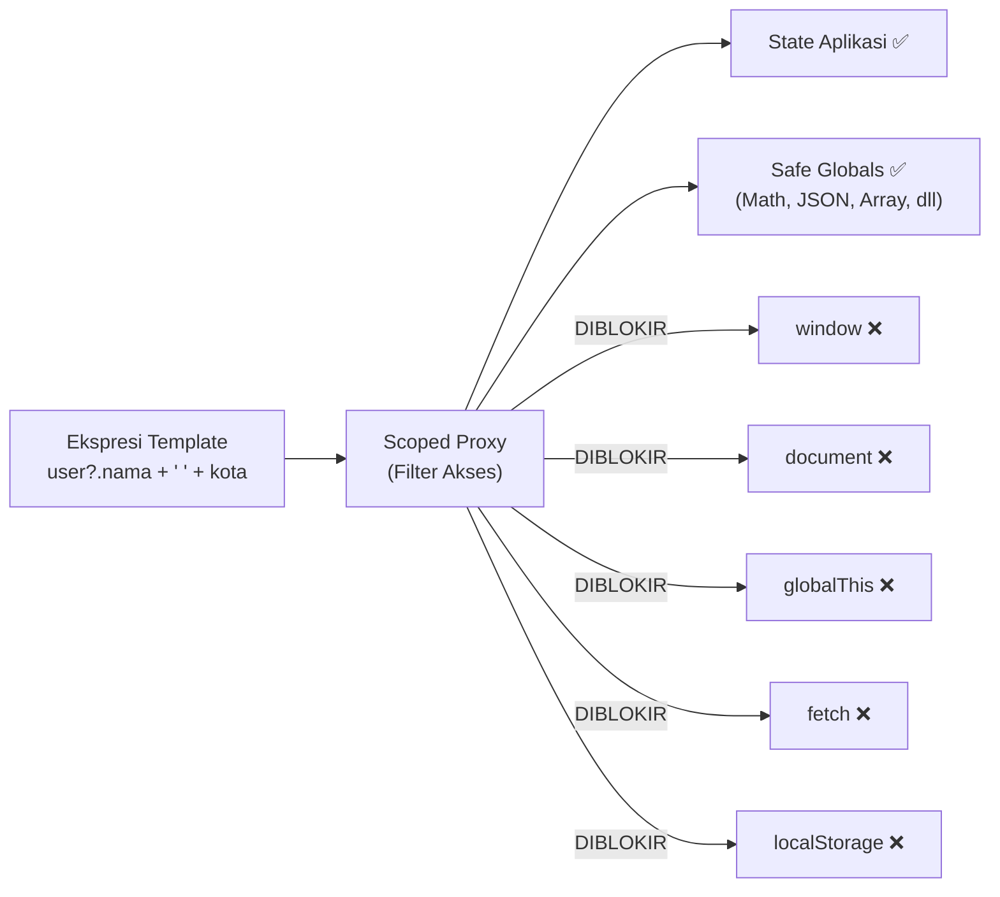

# Sanitasi & Keamanan

> **Versi:** RaaJS v3.1.0 "Data Liberation"
>
> Membahas tentang lapisan benteng pertahanan terakhir terhadap XSS.

---

Keamanan bukan fitur tambahan yang bisa dipasang belakangan — ia harus menjadi fondasi. RaaJS dirancang dengan asumsi bahwa data dari luar tidak bisa dipercaya, ekspresi template tidak boleh menjadi celah, dan pengguna tidak pernah menanggung akibat dari kelalaian developer. Halaman ini membahas tuntas bagaimana RaaJS menjagamu — dan cara memastikan kamu tidak membuka kunci pintu yang sudah terkunci.

---

## Ancaman yang Coba Dicegah

Sebelum bicara solusi, penting untuk memahami ancaman nyata yang dihadapi aplikasi web modern.

**XSS (Cross-Site Scripting)** adalah serangan di mana penyerang menyisipkan kode JavaScript berbahaya ke dalam halaman webmu — biasanya melalui data yang dimasukkan pengguna, konten dari API, atau parameter URL. Jika kode tersebut berhasil dieksekusi di browser orang lain, penyerang bisa mencuri cookie sesi, mengambil alih akun, atau melakukan tindakan atas nama pengguna tanpa sepengetahuannya.

```javascript
// Skenario serangan XSS klasik:
// Bayangkan nama pengguna dari database berisi ini:
const namaUser = '';

// Jika kamu melakukan ini tanpa proteksi:
document.getElementById('salam').innerHTML = 'Halo, ' + namaUser;
// → Gambar gagal dimuat, onerror dieksekusi, cookie dikirim ke penyerang
```

RaaJS menutup celah ini dari dua arah: di level **output** (apa yang ditampilkan ke DOM) dan di level **evaluasi** (bagaimana ekspresi template diproses).

---

## Lapisan 1: `raa-bind:text` — Selalu Aman, Tanpa Pengecualian

Cara termudah untuk tetap aman adalah menggunakan `raa-bind:text` untuk menampilkan data. Direktif ini secara otomatis melakukan **escaping** — mengubah karakter HTML menjadi entitas yang tidak bisa dieksekusi browser sebagai kode.

```html
<div raa-core:app="safeDemo">
  <p raa-bind:text="pesanDariPengguna"></p>
</div>

<script>
  RaaJS.define('safeDemo', () => ({
    state: {
      // Meski state berisi markup berbahaya...
      pesanDariPengguna: '<script>alert("XSS!")<\/script><b>Teks Tebal</b>'
    }
  }));
</script>
```

Hasilnya di layar akan tampil sebagai teks literal:
```
<script>alert("XSS!")</script><b>Teks Tebal</b>
```

Bukan sebagai markup yang dieksekusi. RaaJS menggunakan `el.textContent = nilai` di bawah tenda, bukan `innerHTML` — sehingga browser tidak pernah mem-parse string tersebut sebagai HTML.

**Aturan nomor satu keamanan RaaJS: default ke `raa-bind:text` untuk semua data yang berasal dari pengguna atau sumber eksternal.**

---

## Lapisan 2: Sanitasi HTML untuk `raa-bind:html`

Ada kalanya kamu memang perlu merender HTML — misalnya konten artikel dari CMS, deskripsi produk yang punya format, atau output dari rich text editor. Untuk kebutuhan ini ada `raa-bind:html`.

Tapi karena `raa-bind:html` memasukkan string langsung ke `innerHTML`, RaaJS tidak bisa sekedar memasukkannya begitu saja. Sebelum konten menyentuh DOM, ia melewati proses **sanitasi** yang memfilter semua yang berpotensi berbahaya.

### Bagaimana Sanitizer Bawaan Bekerja

Sanitizer bawaan RaaJS menggunakan pendekatan **allowlist** — ia hanya mengizinkan tag dan atribut yang ada dalam daftar putihnya. Semua yang tidak dikenal dibuang.

**Tag yang diizinkan:**

```
a, b, blockquote, br, code, div, em, h1, h2, h3, h4, h5, h6,
hr, i, img, li, ol, p, pre, section, span, strong, sub, sup,
table, tbody, td, th, thead, tr, u, ul, small
```

**Tag yang diblokir total (dan dihapus beserta isinya):**

```
script, iframe, object, embed, applet, base, form, link, meta
```

**Atribut yang diizinkan:**

```
class, id, title, alt, href, src, width, height,
colspan, rowspan, target, rel, role,
dan semua atribut aria-* dan data-*
```

**Atribut yang diblokir:**
- Semua event handler: `onclick`, `onload`, `onerror`, `onmouseover`, dan semua yang dimulai dengan `on`
- Atribut URL berbahaya: `href` atau `src` yang dimulai dengan `javascript:` atau `data:text/html`

**Perlakuan khusus untuk `target="_blank"`:**
Saat sebuah link menggunakan `target="_blank"`, RaaJS otomatis menambahkan `rel="noopener noreferrer"` — ini mencegah serangan *tab-napping* di mana halaman yang dibuka di tab baru bisa memanipulasi tab aslinya.

### Contoh Sanitasi

```html
<div raa-core:app="sanitasiDemo">
  <div raa-bind:html="konten"></div>
</div>

<script>
  RaaJS.define('sanitasiDemo', () => ({
    state: {
      konten: `
        <h3>Artikel Saya</h3>
        <p>Ini teks <strong>tebal</strong> dan <em>miring</em>.</p>

        <!-- Ini akan DIBUANG oleh sanitizer: -->
        <script>alert('XSS')<\/script>
        
        <a href="javascript:void(alert('XSS'))">Klik</a>
        <iframe src="https://evil.com"></iframe>

        <!-- Ini akan DIIZINKAN: -->
        <a href="https://raajs.dev" target="_blank">Website RaaJS</a>
        
        <blockquote>Kutipan yang elegan.</blockquote>
        <code>kodenya di sini</code>
      `
    }
  }));
</script>
```

Hasil setelah sanitasi — yang berbahaya dibuang, yang aman tetap ada — dengan `rel="noopener noreferrer"` ditambahkan ke link eksternal secara otomatis.

---

## Lapisan 3: Isolasi Scope Ekspresi

Ini adalah lapisan keamanan yang bekerja di balik layar dan sering tidak disadari — tapi sangat krusial.

RaaJS menggunakan **Scoped Proxy** untuk mengevaluasi semua ekspresi template. Proxy ini bertindak sebagai filter yang membatasi apa yang bisa diakses oleh ekspresi:



Artinya: ekspresi yang kamu tulis di template **tidak bisa mengakses `window`, `document`, `globalThis`, `fetch`, `localStorage`**, atau objek global apa pun yang tidak secara eksplisit diizinkan oleh RaaJS.

```html
<!-- Ini tidak akan bekerja — dan ini yang kita inginkan -->
<p raa-bind:text="window.location.href"></p>  <!-- undefined -->
<p raa-bind:text="document.cookie"></p>       <!-- undefined -->
<p raa-bind:text="localStorage.getItem('token')"></p>  <!-- undefined -->

<!-- Yang ini bekerja karena diizinkan eksplisit -->
<p raa-bind:text="Math.random()"></p>       <!-- ✅ safe global -->
<p raa-bind:text="JSON.stringify(data)"></p> <!-- ✅ safe global -->
```

Kenapa ini penting? Bayangkan skenario di mana konten dari CMS atau API disisipkan ke dalam ekspresi template secara dinamis. Tanpa isolasi scope, penyerang yang berhasil memanipulasi konten tersebut bisa mengeksekusi `document.cookie` dan mencuri sesi pengguna. Dengan Scoped Proxy, bahkan jika ada upaya injeksi, ia tidak akan menemukan apa yang dicarinya.

### Zero-Eval: Tidak Ada `eval()` atau `new Function()`

Evaluasi ekspresi di RaaJS menggunakan parser AST kustom — **bukan** `eval()` dan **bukan** `new Function()`. Ini punya dua konsekuensi penting:

**Keamanan:** Tidak ada celah yang dieksploitasi oleh kebijakan CSP (`script-src 'unsafe-eval'`). RaaJS bisa digunakan di lingkungan dengan CSP paling ketat, termasuk aplikasi enterprise dan ekstensi browser.

**Prediktabilitas:** Ekspresi yang tidak didukung tidak akan dieksekusi secara diam-diam dengan perilaku tak terduga — ia akan gagal dengan pesan error yang informatif di konsol.

```
[RaaJS warn:EVAL_FAIL] Expression evaluation failed: "expr" — pesan error
```

---

## Kapan (dan Bagaimana) Menonaktifkan Sanitasi

Ada skenario sah di mana sanitasi bawaan perlu dinonaktifkan atau diganti — misalnya ketika kamu menggunakan library sanitasi yang lebih canggih, atau ketika konten HTML yang ditampilkan dijamin aman karena kamu sendiri yang membuatnya.

### Opsi 1: `trustHTML: true` — Nonaktifkan Sepenuhnya

```javascript
// Buat instance RaaJS manual dengan trustHTML
// (Normalnya RaaJS membuat instance otomatis di DOMContentLoaded)
// Ini perlu dilakukan sebelum DOMContentLoaded
const raa = new RaaJS({ trustHTML: true });
```

> **⚠️ Peringatan keras:** Gunakan `trustHTML: true` **hanya** jika kamu 100% yakin semua HTML yang masuk ke `raa-bind:html` sudah bersih. Jika ada satu saja sumber data yang tidak terpercaya menyentuh `raa-bind:html` dengan opsi ini aktif, pintu XSS terbuka lebar.

### Opsi 2: Custom Sanitizer — Cara yang Disarankan

Jika sanitasi bawaan kurang ketat atau tidak sesuai kebutuhanmu, gunakan library sanitasi terpercaya seperti [DOMPurify](https://github.com/cure53/DOMPurify) sebagai custom sanitizer:

```html
<!-- Muat DOMPurify terlebih dahulu -->
<script src="https://cdn.jsdelivr.net/npm/dompurify@3/dist/purify.min.js"></script>
<script src="https://cdn.jsdelivr.net/gh/dazep01/raajs@3.1.0/engine/raa.min.js"></script>

<script>
  // Override instance RaaJS dengan custom sanitizer
  // Ini harus dilakukan setelah DOMContentLoaded
  document.addEventListener('DOMContentLoaded', () => {
    // Ganti sanitizer bawaan dengan DOMPurify
    window.Raa._sanitizer = (html) => DOMPurify.sanitize(html, {
      ALLOWED_TAGS: ['b', 'i', 'em', 'strong', 'a', 'p', 'br', 'ul', 'ol', 'li', 'code', 'pre'],
      ALLOWED_ATTR: ['href', 'target', 'rel', 'class'],
      FORCE_BODY: true
    });
  });
</script>
```

Atau saat membuat instance manual:

```javascript
const raa = new RaaJS({
  sanitizer: (html) => DOMPurify.sanitize(html, {
    USE_PROFILES: { html: true }
  })
});
```

DOMPurify adalah standar industri untuk sanitasi HTML di browser — ia digunakan oleh Google, Mozilla, dan ribuan aplikasi enterprise. Untuk konten yang benar-benar penting keamanannya, menggabungkan sanitizer bawaan RaaJS dengan DOMPurify memberikan lapisan perlindungan ganda.

---

## Daftar Lengkap Tag yang Diizinkan dan Diblokir

### ✅ Tag yang Diizinkan oleh Sanitizer Bawaan

| Kategori | Tag |
|---|---|
| **Struktur** | `div`, `section`, `p`, `br`, `hr` |
| **Heading** | `h1`, `h2`, `h3`, `h4`, `h5`, `h6` |
| **Teks** | `b`, `strong`, `i`, `em`, `u`, `small`, `sub`, `sup`, `code`, `pre` |
| **List** | `ul`, `ol`, `li` |
| **Tabel** | `table`, `thead`, `tbody`, `tr`, `th`, `td` |
| **Media** | `img` (src yang aman), `a` (href yang aman) |
| **Lainnya** | `span`, `blockquote` |

### ❌ Tag yang Diblokir (Dihapus Beserta Isinya)

| Tag | Alasan Diblokir |
|---|---|
| `<script>` | Eksekusi JavaScript langsung |
| `<iframe>` | Embedding konten eksternal berbahaya |
| `<object>` | Plugin yang berpotensi berbahaya |
| `<embed>` | Embedding media/plugin |
| `<applet>` | Java applet (usang & berbahaya) |
| `<base>` | Mengubah base URL halaman |
| `<form>` | Bisa digunakan untuk phishing |
| `<link>` | Memuat stylesheet atau resource eksternal |
| `<meta>` | Redirect, charset manipulation |

### Atribut yang Selalu Dihapus

| Pola | Contoh |
|---|---|
| Semua event handler | `onclick`, `onerror`, `onload`, `onmouseover`, `onfocus`, `onblur`, semua `on*` |
| URL dengan protokol berbahaya | `href="javascript:..."`, `src="data:text/html;..."` |
| Atribut tidak dikenal | Semua yang tidak ada di allowlist |

---

## Panduan Praktis: Checklist Keamanan

Berikut adalah checklist yang bisa kamu jadikan kebiasaan saat membangun aplikasi RaaJS:

### ✅ Gunakan `raa-bind:text` untuk data pengguna

```html
<!-- ✅ Aman — selalu escape otomatis -->
<p raa-bind:text="komentarPengguna"></p>
<p raa-bind:text="judulDariApi"></p>
<p raa-bind:text="inputFormPengguna"></p>

<!-- ⚠️ Hati-hati — pastikan konten sudah tersanitasi -->
<div raa-bind:html="artikelDariCms"></div>
```

### ✅ Jangan simpan data sensitif di `state` kecuali perlu

```javascript
// ❌ Jangan — password tidak boleh ada di reactive state
state: {
  password: '',
  kartuKreditNomor: ''
}

// ✅ Gunakan form biasa untuk data sensitif,
//    proses di method, jangan simpan di state
methods: {
  async login() {
    const inputEl = this.$refs.inputPassword;
    const password = inputEl.value;
    // Kirim ke server, jangan assign ke state
    await fetch('/api/login', {
      method: 'POST',
      body: JSON.stringify({ password })
    });
    inputEl.value = ''; // Bersihkan dari DOM juga
  }
}
```

### ✅ Validasi di server, bukan hanya di klien

`raa-validate.js` memberikan feedback visual yang bagus untuk pengguna — tapi jangan jadikan itu satu-satunya validasi. Selalu validasi ulang di sisi server. Validasi klien mudah diabaikan oleh pengguna dengan browser devtools.

### ✅ Hati-hati dengan `raa-eco:persist`

State yang di-persist ke `localStorage` bisa dibaca dan dimodifikasi oleh pengguna atau skrip pihak ketiga. Jangan persist data sensitif:

```javascript
// ❌ Jangan persist token auth di state RaaJS
<div raa-core:app="app" raa-eco:persist="app-data">
// state: { token: 'jwt...', userRole: 'admin' }

// ✅ Boleh persist preferensi UI yang tidak sensitif
<div raa-core:app="app" raa-eco:persist="ui-preferences">
// state: { darkMode: true, bahasa: 'id', ukuranFont: 16 }
```

### ✅ DevTools hanya untuk development

File `raa-devtools.js` memungkinkan siapa pun yang membuka browser untuk melihat dan memodifikasi state aplikasi langsung dari panel DevTools. Sangat berguna saat development, sangat berbahaya di production.

```html
<!-- Pastikan baris ini TIDAK ada di production build -->
<script src="...raa-devtools.min.js"></script>
```

---

## Contoh: Aplikasi yang Aman dalam Praktik

Berikut adalah contoh aplikasi komentar yang mendemonstrasikan praktik keamanan yang tepat — menampilkan konten dari pengguna dengan aman, memvalidasi input, dan menangani HTML dari sumber eksternal dengan benar:

```html
<!DOCTYPE html>
<html lang="id">
<head>
  <meta charset="UTF-8">
  <title>Kolom Komentar Aman — RaaJS</title>
  <style>
    * { box-sizing: border-box; }
    body { font-family: sans-serif; max-width: 600px; margin: 40px auto; padding: 0 16px; }
    .komentar { border: 1px solid #e2e8f0; border-radius: 12px; padding: 16px; margin-bottom: 12px; }
    .komentar-header { display: flex; gap: 8px; align-items: center; margin-bottom: 8px; }
    .avatar { width: 32px; height: 32px; border-radius: 50%; background: #3b82f6; color: white; display: flex; align-items: center; justify-content: center; font-weight: 700; font-size: 14px; flex-shrink: 0; }
    .nama { font-weight: 600; font-size: 14px; }
    .waktu { font-size: 11px; color: #94a3b8; }
    .isi { font-size: 14px; color: #374151; line-height: 1.6; }
    .form { background: #f8fafc; border-radius: 12px; padding: 20px; margin-bottom: 24px; }
    input, textarea { width: 100%; border: 1px solid #e2e8f0; border-radius: 8px; padding: 10px 12px; font-size: 14px; margin-bottom: 8px; font-family: inherit; }
    input:focus, textarea:focus { outline: none; border-color: #3b82f6; }
    textarea { height: 80px; resize: vertical; }
    button { background: #3b82f6; color: white; border: none; border-radius: 8px; padding: 10px 20px; cursor: pointer; font-size: 14px; font-weight: 600; }
    button:disabled { opacity: 0.5; cursor: not-allowed; }
    .error { color: #dc2626; font-size: 12px; margin-top: -4px; margin-bottom: 8px; }
    .label { font-size: 12px; font-weight: 600; color: #374151; margin-bottom: 4px; display: block; }
    .badge-aman { display: inline-block; background: #dcfce7; color: #15803d; font-size: 10px; padding: 2px 8px; border-radius: 20px; margin-left: 8px; font-weight: 600; }
  </style>
</head>
<body>

  <h2>💬 Kolom Komentar <span class="badge-aman">XSS-Safe</span></h2>
  <p style="color: #64748b; font-size: 13px; margin-bottom: 24px;">
    Coba ketik HTML atau skrip berbahaya di form bawah —
    RaaJS akan memastikan tidak ada yang dieksekusi.
  </p>

  <div raa-core:app="komentarApp">

    <!-- Form Komentar -->
    <div class="form">
      <h3 style="margin: 0 0 16px; font-size: 15px;">Tulis Komentar</h3>

      <label class="label">Nama</label>
      <input type="text"
             raa-bind:model="formNama"
             raa-on:input="validasi()"
             placeholder="Nama panggilanmu...">
      <template raa-flow:if="errorNama">
        <p class="error" raa-bind:text="errorNama"></p>
      </template>

      <label class="label">Komentar</label>
      <textarea raa-bind:model="formIsi"
                raa-on:input="validasi()"
                placeholder="Tulis komentarmu... (coba ketik <script>alert('xss')</script>)"></textarea>
      <template raa-flow:if="errorIsi">
        <p class="error" raa-bind:text="errorIsi"></p>
      </template>

      <div style="display: flex; justify-content: space-between; align-items: center;">
        <span style="font-size: 12px; color: #94a3b8;"
              raa-bind:text="formIsi.length + '/500 karakter'"></span>
        <button raa-on:click="kirim()"
                raa-ux:disable="!formValid || sedangKirim">
          <span raa-bind:text="sedangKirim ? 'Mengirim...' : 'Kirim Komentar'"></span>
        </button>
      </div>
    </div>

    <!-- Daftar Komentar -->
    <div>
      <h3 style="font-size: 15px; margin-bottom: 16px;"
          raa-bind:text="komentar.length + ' Komentar'"></h3>

      <template raa-flow:if="komentar.length === 0">
        <p style="color: #94a3b8; text-align: center; padding: 32px 0; font-size: 14px;">
          Belum ada komentar. Jadilah yang pertama! ✨
        </p>
      </template>

      <template raa-flow:for="item in komentar" raa-key="item.id">
        <div class="komentar">
          <div class="komentar-header">
            <div class="avatar" raa-bind:text="inisial(item.nama)"></div>
            <div>
              <!--
                raa-bind:text — AMAN untuk nama pengguna
                Meski nama berisi HTML, ia akan tampil sebagai teks literal
              -->
              <div class="nama" raa-bind:text="item.nama"></div>
              <div class="waktu" raa-bind:text="item.waktu"></div>
            </div>
          </div>
          <!--
            raa-bind:text — AMAN untuk isi komentar dari pengguna
            JANGAN gunakan raa-bind:html di sini kecuali konten sudah sanitasi ketat
          -->
          <div class="isi" raa-bind:text="item.isi"></div>
        </div>
      </template>
    </div>

  </div>

  <script src="https://cdn.jsdelivr.net/gh/dazep01/raajs@3.1.0/engine/raa.min.js"></script>
  <script>
    RaaJS.define('komentarApp', () => ({
      state: {
        formNama: '',
        formIsi: '',
        errorNama: '',
        errorIsi: '',
        formValid: false,
        sedangKirim: false,
        komentar: [
          {
            id: 1,
            nama: 'Andi Pratama',
            // Komentar ini berisi HTML — tapi aman karena pakai raa-bind:text
            isi: 'RaaJS benar-benar keren! <b>Framework terbaik</b> yang pernah saya coba.',
            waktu: '5 menit yang lalu'
          },
          {
            id: 2,
            nama: 'Citra Dewi',
            isi: 'Saya suka bagaimana RaaJS menangani reaktivitas tanpa virtual DOM.',
            waktu: '12 menit yang lalu'
          }
        ]
      },

      methods: {
        validasi() {
          this.errorNama = '';
          this.errorIsi = '';

          if (this.formNama.trim().length < 2) {
            this.errorNama = 'Nama minimal 2 karakter.';
          }
          if (this.formIsi.trim().length < 5) {
            this.errorIsi = 'Komentar minimal 5 karakter.';
          }
          if (this.formIsi.trim().length > 500) {
            this.errorIsi = 'Komentar maksimal 500 karakter.';
          }

          this.formValid = (
            !this.errorNama &&
            !this.errorIsi &&
            this.formNama.trim().length >= 2 &&
            this.formIsi.trim().length >= 5
          );
        },

        async kirim() {
          this.validasi();
          if (!this.formValid) return;

          this.sedangKirim = true;

          // Simulasi delay pengiriman ke server
          await new Promise(r => setTimeout(r, 800));

          // Simpan ke state — raa-bind:text yang akan memastikan keamanannya saat ditampilkan
          this.komentar.unshift({
            id: Date.now(),
            nama: this.formNama.trim(),
            isi: this.formIsi.trim(),  // Disimpan apa adanya, aman saat ditampilkan via :text
            waktu: 'Baru saja'
          });

          // Reset form
          this.formNama = '';
          this.formIsi = '';
          this.formValid = false;
          this.sedangKirim = false;
        },

        inisial(nama) {
          return nama
            .split(' ')
            .slice(0, 2)
            .map(kata => kata.charAt(0).toUpperCase())
            .join('');
        }
      }
    }));
  </script>

</body>
</html>
```

Perhatikan dua hal kunci di contoh ini. Pertama, semua data dari pengguna — nama dan isi komentar — ditampilkan menggunakan `raa-bind:text`, bukan `raa-bind:html`. Meski konten berisi HTML atau skrip berbahaya, ia akan tampil sebagai teks biasa. Kedua, komentar bawaan yang secara sengaja berisi `<b>Framework terbaik</b>` akan tampil as-is tanpa rendering HTML — membuktikan bahwa `raa-bind:text` memang tidak memproses markup.

---

## Ringkasan: Tiga Lapisan Keamanan RaaJS

RaaJS melindungi aplikasimu melalui tiga lapisan yang bekerja bersama:

Lapisan pertama adalah **escaping otomatis** di `raa-bind:text` — data apa pun yang kamu tampilkan via direktif ini tidak akan pernah bisa dieksekusi sebagai kode, tidak peduli isinya apa.

Lapisan kedua adalah **sanitasi HTML** di `raa-bind:html` — konten HTML yang perlu dirender tetap melewati filter allowlist yang ketat sebelum menyentuh DOM. Tag berbahaya dan event handler tidak pernah lolos.

Lapisan ketiga adalah **isolasi scope ekspresi** — evaluator ekspresi template tidak bisa mengakses `window`, `document`, atau global berbahaya lainnya. Bahkan jika ada upaya injeksi ekspresi, ia tidak akan menemukan apa yang dicarinya.

Tiga lapisan ini bekerja secara default, tanpa konfigurasi tambahan. Yang perlu kamu lakukan hanya satu: **jangan menonaktifkannya tanpa alasan yang sangat kuat**.

---

*Dokumentasi ini adalah bagian dari RaaJS v3.1.0 Official Docs. Kontribusi dan koreksi disambut di repositori resmi.*
